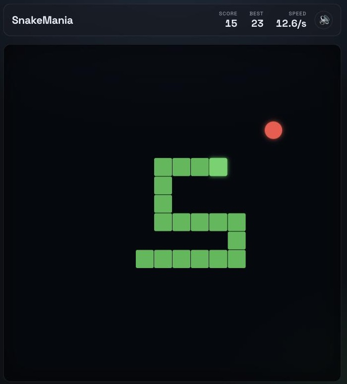

<div align="center">

# 🐍 SnakeMania

**A small, fast, dependency-free arcade snake.**
No frameworks. No build step. No `node_modules`. Just open `index.html`.

[**▶ Play it**](https://arsalan507.github.io/Snakegame/) &nbsp;·&nbsp;
[Controls](#controls) &nbsp;·&nbsp;
[How it works](#how-it-works) &nbsp;·&nbsp;
[Run it locally](#run-it-locally)




</div>

---

## The game

Steer the snake, eat the food, don't hit the walls or yourself. Every meal makes
you longer **and** faster — the board never changes size, so the difficulty comes
entirely from the space you've already eaten your way through.

Your best score is kept in `localStorage`, so it survives a refresh.

## Controls

| Action | Keyboard | Touch |
| --- | --- | --- |
| Steer | <kbd>↑</kbd> <kbd>↓</kbd> <kbd>←</kbd> <kbd>→</kbd> or <kbd>W</kbd> <kbd>A</kbd> <kbd>S</kbd> <kbd>D</kbd> | Swipe on the board |
| Start / restart | <kbd>Space</kbd>, <kbd>Enter</kbd>, or any direction | Tap **Play** |
| Pause / resume | <kbd>Space</kbd> or <kbd>P</kbd> | Tap **Resume** |
| Mute | <kbd>M</kbd> | 🔊 button |

Switching away from the tab pauses automatically, so you don't lose a run to a
notification.

## Run it locally

There is no build step and nothing to install.

```bash
git clone https://github.com/arsalan507/Snakegame.git
cd Snakegame
```

Then either open `index.html` directly, or serve the folder so the audio loads
without `file://` restrictions:

```bash
python3 -m http.server 8000
# → http://localhost:8000
```

## How it works

The whole game is ~300 lines of vanilla JavaScript in [`js/index.js`](js/index.js).
Four decisions do most of the work:

**A fixed-timestep loop.** `requestAnimationFrame` fires at whatever rate the
display runs at, which is not a game speed. An accumulator converts those frames
into a fixed number of *moves per second*, so the snake travels at the same pace
on a 60 Hz laptop and a 144 Hz monitor:

```js
accumulator += dt;
while (accumulator >= 1 / speed) {
  accumulator -= 1 / speed;
  step();
}
```

`dt` is clamped, so a backgrounded tab can't bank ten seconds of time and then
fast-forward the snake into a wall on return.

**A turn queue instead of a direction variable.** Writing the new direction
straight into `dir` lets two fast taps — right, then up, then left, all inside a
single move — fold the snake back into its own neck. Turns are queued and
validated against *the last queued turn* rather than the live direction, so an
illegal reversal is impossible no matter how fast you mash:

```js
const last = queued.length ? queued[queued.length - 1] : dir;
if (d.x === -last.x && d.y === -last.y) return; // no 180s
```

**Food is drawn from the free cells.** The naive approach — pick random
coordinates, retry if occupied — gets slower exactly when the board is fullest,
and never terminates on a full board. Instead the free cells are collected and
one is chosen directly, which is uniform, always terminates, and gives the
perfect-game ending for free when the list comes back empty.

**The board is built once.** The grid is `COLS * ROWS` cells created at boot;
each move re-classes only the cells that changed, rather than tearing down and
rebuilding the DOM every frame.

## Project structure

```
Snakegame/
├── index.html        # markup: HUD, board mount, overlay
├── css/style.css     # theme tokens, responsive grid board, overlay
├── js/index.js       # the entire game
├── img/              # background art
├── music/            # sound effects and loop
└── docs/             # screenshot used by this README
```

## Roadmap

- [ ] Wrap-around walls as a selectable mode
- [ ] Obstacle tiles at higher scores
- [ ] On-screen D-pad as a swipe alternative
- [ ] Colour-blind-safe palette toggle

## Credits

- Fonts — [Google Fonts](https://fonts.google.com/) (Space Grotesk)
- Sound effects — [Freesound](https://freesound.org/)
- Background art — [Unsplash](https://unsplash.com/)

## License

[MIT](LICENSE) © Arsalan Ahmed
